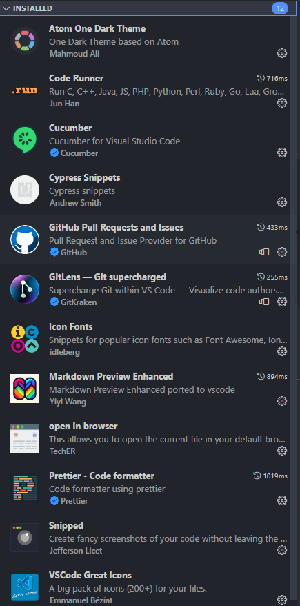

**Установка приложений:**
- [VSCode](https://code.visualstudio.com/)
- [GitBash](https://git-scm.com/downloads) 
- [Node.js](https://nodejs.org/en/download/)
- Install Extensions


**Иициализировать утилиты**
Иициализировать утилиты необходимо через terminal. Команды:
**1.** npm init
**2.** npm install --save-dev jest
**2.1** В файле package.json добавить строчку или изменить текущую:
```javascript
  "scripts": {
    "test": "jest"
  },
  ```
**3.** npm install --save-dev chai

**Работа**
**1.** Клонировать себе репозиторий
Использовать команду в терминале git clone https://github.com/vmarasinskiy/qa_auto_2.2.1.git или в VScode нажать на F1 и вставить ссылку, после чего указать путь, где будет хранится репозиторий.

Можно работать с кодом.